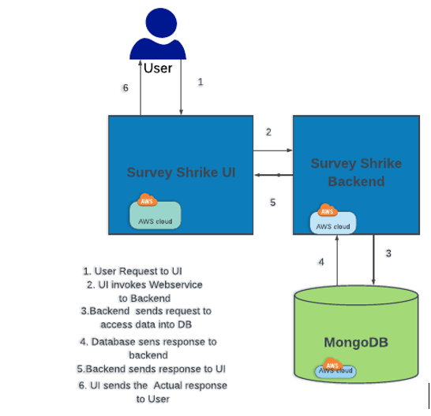

# SurveyShrike
> Survey shrike is a free online survey tool. SurveyShrike help businesses conduct surveys. SurveyShrike believes every customer has different views or comments about services and over all products. And every business needs to know right customer mindset to engage customers for long run. SurveyShrike is trying to solve this problem and needs your help to build a web-based application.

## Architecture
Below is the application Architecture diagram.

	Where We have two major components:

* SurveyShrike-Backend : Exposes Rest Webservice for SurveyShrike Frontends to communicate to Persistence layer (Mongo DB)
	 
	 Tech Stack:
		* Java 1.8
		* Java 1.8
		* Maven
		* Spring Boot
		* JWT for Authentication
		* Mongo DB (No SQL Database) for persisting Data
		* Spring Data Rest: Spring Data REST is part of the umbrella Spring Data project and makes it easy to build hypermedia-driven REST web services on top of Spring Data repositories
		*Testing frame work

* SurveyShrike-UI:  Provides the User Interface for Survey Shrike.
	
	Tech Stack:
		*Angular 
		*npm
		*Angular CLI version 8.3.
	*Bootstrap

## Final Artefacts Details

* Jenkins URL : http://15.206.34.235:8080/view/SurveyShrike/
* Application URL on AWS : http://15.206.34.235:4200
* AWS public Image name (AMI) (With Jenkins and application) on Asia Pacific (Mumbai) Region : SurveyShrike_RanuGhosh

__Instance might be in stop mode. And the same can be made  up with single click._

## Functional Overview

* SuerveyShrike provides a Page for Register a User with option Admin or NonAdmin. Once the User is registered. User will be asked to Login. 
* User will be authenticated using JWT
* Non Admin user :
		
		> * If logged in using Non admin user, user will be able to view and fill various available Survey for that at first user will be asked to select a specific survey and fill the information and submit.
		 
		 * The submitted survey information will be persisted into Database (Mongo DB)

* Admin user :
		
		> * If logged in using Admin user, they will be having multiple option such as 
		1) Creating a new Survey format
		2)View all the filled Survey information
		3) Fill a specific Survey information.

## DataBase : MongoDB in AWS EC2

Have configured MongoDB into a configured  AWS EC2 Instance.
	 
	 > DB Name:ServeyShrike
	 	Host : ServeyShrike
		Operation System: Windows 
		Final AWS AMI Image on Asia Pacific Mumbai) Region: SurveyShrike_RanuGhosh
		Elastic Ip : 15.206.15.243

## Deployment Into AWS EC2

Survey Shrike is configured to be deployed on AWS EC2 Instance.
We have created an EC2 instance with following properties:
	 
	 > CPU: 1
		Memory: 1GB
		EBS: 30GB
		Type: t2.micro
		Operation System: Windows 
		Final AWS AMI Image on Asia Pacific Mumbai) Region: SurveyShrikeMongoDB_Ranu
		Elastic Ip : 15.206.34.235

## More Info

For more information please visit  below path:

<https://github.com/ranugh/SurveyShrike/blob/master/Documents/SurveyShrike-Doc.docx>
